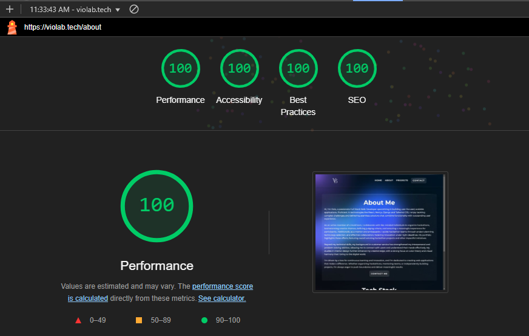

# **VB Portfolio**

## Table of Contents

- [Tech](#tech)
- [Typography](#typography)
- [Deployment](#deployment)
- [Credits](#credits)

## Tech

- [Next.js](https://nextjs.org/)
- [React.js](https://react.dev/)
- [Tailwind CSS](https://tailwindcss.com/)
- [Vercel](https://vercel.com/)
- [Favicon generator](https://www.favicon-generator.org/) - Favicon and apple icon
- [Canva](https://www.canva.com/) - Logo
- [Embla Carousel](https://www.embla-carousel.com/) - Project carousel
- [Simple Icons](https://simpleicons.org/) - Tech icons
- [Mailgun](https://www.mailgun.com/) - Contact form functionality

## Typography

- [Google font Montserrat](https://fonts.google.com/specimen/Montserrat?vfquery=mont)

## Deployment

This project was deployed on Vercel. 
The easiest way to deploy Next.js app is to use the [Vercel Platform](https://vercel.com/new?utm_medium=default-template&filter=next.js&utm_source=create-next-app&utm_campaign=create-next-app-readme) from the creators of Next.js.

Check out [Next.js deployment documentation](https://nextjs.org/docs/app/building-your-application/deploying) for more details.

## Testing

### Lighthouse

|   PAGE                                     | LIGHTHOUSE SCREENSHOT                                     |
|--------------------------------------------|-----------------------------------------------------------|
|   Desktop                                  |                                                           |
| Home                                       |

Home Page

|
| About                                      |

About Page

|
| Projects                                   |

Projects

|
| Project Detail Page                        |

Project Detail Page

|
| Contact                                    |

Contact

|

## Credits

- [Codepen](https://codepen.io/Podgro/pen/oNOKYqr) - Interactive Gradient & Glassmorphism with noise
